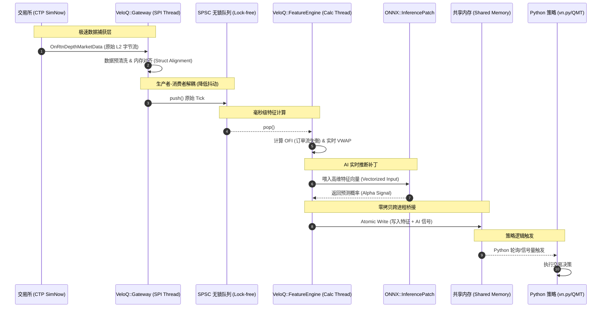

<div align="center">

> ⚠️ **项目暂停通知**
>
> 非常抱歉，由于工作繁忙个人精力有限，本项目即日起**无限期停更**。
>
> 量化一直是我的热爱，VeloQ 也是我认真设计的项目。未来如果有缘，生活节奏稳定下来后，我一定会想办法继续下去。
>
> 感谢每一位 star 和关注这个项目的朋友。没能达到当初预期的状态，深感抱歉 🙏
>
> — Shuheng Mo


# VeloQ

> 高性能 C++ 行情处理中间件，为 vn.py 等 Python 量化框架加速特征计算和 AI 推断，将延迟从毫秒降至微秒

[](LICENSE)
[](https://github.com/yourusername/veloq/releases)
[](https://github.com/yourusername/veloq/actions)
[](https://en.cppreference.com/w/cpp/17)
[](CONTRIBUTING.md)

[English](README_EN.md) | [简体中文](README.md)

</div>

---

## 目录

- [项目简介](#项目简介)
- [核心特性](#核心特性)
- [技术栈](#技术栈)
- [系统架构](#系统架构)
- [快速开始](#快速开始)
  - [环境要求](#环境要求)
  - [安装步骤](#安装步骤)
- [使用指南](#使用指南)
- [项目结构](#项目结构)
- [配置说明](#配置说明)
- [API 文档](#api-文档)
- [开发指南](#开发指南)
- [测试](#测试)
- [部署](#部署)
- [性能指标](#性能指标)
- [常见问题](#常见问题)
- [更新日志](#更新日志)
- [贡献指南](#贡献指南)
- [许可证](#许可证)
- [联系方式](#联系方式)
- [致谢](#致谢)

---

## 项目简介

**VeloQ**（Velocity + Quant）是一个专为量化交易设计的**高性能行情数据加速中间件**。

### 这是什么？

VeloQ 通过 C++ 实现微秒级（μs）的行情解析、特征工程和 AI 实时推断，为现有的 Python 量化框架（如 vn.py、MiniQMT）提供"涡轮增压"能力。它采用"侧边栏"架构，通过共享内存与 Python 策略层无缝集成，实现：

- 📡 **CTP 行情极速接收**：无锁队列设计，网络线程不被计算阻塞
- 🧮 **实时特征计算**：OFI、盘口压力、VWAP 等微观特征，亚毫秒级完成
- 🤖 **AI 模型实时推断**：基于 ONNX Runtime，端到端延迟 < 500μs
- 🔗 **零拷贝 IPC 通信**：通过共享内存与 Python 策略通信，延迟 < 10μs
- 📊 **实时可视化监控**：Dear ImGui 打造的极客风格 Dashboard

### 为什么做这个？

当前国内量化散户和中小型机构多使用 Python 框架处理高频行情。然而，Python 的 GIL（全局解释器锁）和动态语言特性导致在**特征计算**和 **AI 模型实时推断**上存在显著延迟（通常 >100ms），难以应对行情剧烈波动场景。

VeloQ 旨在解决这一痛点，通过 C++ 的性能优势将关键路径的延迟降低到微秒级别，同时保持与现有 Python 生态的兼容性。

### 适用场景

- **量化交易员**：需要在高频场景下进行特征计算和 AI 预测
- **HFT 开发者**：追求极致的低延迟行情处理
- **vn.py / MiniQMT 用户**：希望在不改变现有框架的情况下提升性能
- **量化研究人员**：需要实时验证 AI 模型在生产环境的表现

---

## 核心特性

- ⚡ **超低延迟** - 从接收原始数据包到产生 AI 预测，总延迟控制在 500μs 以内
- 🔒 **无锁设计** - 双缓冲区无锁队列（Lock-free Queue），生产消费完全解耦
- 🎯 **SIMD 优化** - 特征计算利用 AVX2 指令集加速，内存对齐优化 Cache 命中率
- 🧠 **即插即用 AI** - 支持 ONNX 格式轻量级深度学习模型，无需重新编译
- 🖥️ **极客美学** - Dear ImGui 实时监控看板，展示盘口热力图、AI 预测曲线和系统延迟
- 🐍 **Python 友好** - 通过共享内存与现有 Python 策略无缝集成，零拷贝读取
- 🛡️ **生产级可靠** - 支持 7×24 小时连续运行，配备 Valgrind/ASan 内存检测

---

## 技术栈

### 核心技术

- [C++ 17/20](https://en.cppreference.com/w/cpp/17) - 现代 C++ 标准，支持高级特性
- [CMake](https://cmake.org/) - 3.20+ - 跨平台构建系统
- [CTP API](http://www.sfit.com.cn/) - 官方上期所期货行情接口
- [Dear ImGui](https://github.com/ocornut/imgui) - 1.89+ - 高性能即时模式 GUI 框架
- [ONNX Runtime](https://github.com/microsoft/onnxruntime) - 1.16+ - AI 推理引擎
- [Boost](https://www.boost.org/) - 1.70+ - Interprocess、System、Thread 组件
- [spdlog](https://github.com/gabime/spdlog) - 1.11+ - 异步高性能日志库

### 开发工具

- [Valgrind](https://valgrind.org/) - 内存泄漏检测
- [AddressSanitizer](https://github.com/google/sanitizers) - 运行时内存错误检测
- [Google Test](https://github.com/google/googletest) - 单元测试框架（可选）
- [Google Benchmark](https://github.com/google/benchmark) - 性能测试框架（可选）

---

## 系统架构

<!-- ```text
┌─────────────────────────────────────────────────────────┐
│                    VeloQ Core (C++)                     │
├──────────────┬──────────────┬──────────────┬────────────┤
│   Gateway    │Feature Engine│  Inference   │ Dashboard  │
│ (CTP API)    │ (OFI/VWAP)   │(ONNX Runtime)│(Dear ImGui)│
└──────┬───────┴──────┬───────┴──────┬───────┴────────────┘
       │              │              │
       └──────────────┴──────────────┘
                      │
              ┌───────▼────────┐
              │  IPC Bridge    │  (共享内存，<10μs)
              │ (Boost.IPC)    │
              └───────┬────────┘
                      │
       ┌──────────────▼──────────────┐
       │   Python Strategy Layer     │
       │  (vn.py / MiniQMT / ...)    │
       └─────────────────────────────┘
``` -->



详细架构设计请参考 [PROJECT_STRUCTURE.md](PROJECT_STRUCTURE.md)

---

## 快速开始

### 环境要求

在开始之前，请确保你的开发环境满足以下要求：

- **操作系统**：Linux (Ubuntu 20.04+) / macOS 11+ / Windows 10+
- **编译器**：支持 C++17 的编译器
  - GCC 7+ / Clang 6+ (Linux/macOS)
  - MSVC 2019+ (Windows)
- **CMake**：>= 3.20
- **Git**：>= 2.0
- **Boost**：>= 1.70 (system, thread, interprocess)
- **CTP API**：从[上期所官网](http://www.sfit.com.cn/)或 [SimNow](http://www.simnow.com.cn/) 下载
- **可选依赖**：
  - ONNX Runtime（用于 AI 推断）
  - Dear ImGui + GLFW + OpenGL（用于 Dashboard）

### 安装步骤

**1. 克隆项目**

```bash
git clone https://github.com/yourusername/veloq.git
cd veloq
```

**2. 安装依赖**

详细依赖安装指南请查看 [docs/build/dependencies.md](docs/build/dependencies.md)

```bash
# Ubuntu/Debian 示例
sudo apt-get update
sudo apt-get install build-essential cmake libboost-all-dev

# macOS 示例
brew install cmake boost
```

**3. 准备第三方库**

```bash
# 按照 third_party/README.md 的指引下载第三方库
mkdir -p third_party
# 将 CTP API、Dear ImGui、ONNX Runtime 等放入 third_party/ 目录
```

**4. 配置环境**

```bash
# 复制配置文件模板
cp config/veloq.example.ini config/veloq.ini
# 编辑配置文件，填入 SimNow 账号信息
nano config/veloq.ini
```

**5. 构建项目**

```bash
mkdir build && cd build
cmake .. \
  -DCMAKE_BUILD_TYPE=Release \
  -DBUILD_TESTS=ON \
  -DBUILD_DASHBOARD=ON
cmake --build . -j8
```

**6. 运行测试**

```bash
ctest --output-on-failure
```

**7. 启动 Dashboard（可选）**

```bash
./bin/veloq_dashboard
```

---

## 使用指南

### 基础用法 - Gateway 连接 CTP

```cpp
#include "veloq/gateway/ctp_gateway.hpp"
#include <iostream>

int main() {
    using namespace veloq::gateway;

    // 创建 CTP Gateway
    CtpGateway gateway;

    // 连接到 SimNow 7x24 仿真环境
    bool connected = gateway.connect(
        "tcp://180.168.146.187:10131",  // 前置地址
        "9999",                          // BrokerID
        "YOUR_USER_ID",                  // 用户名
        "YOUR_PASSWORD"                  // 密码
    );

    if (!connected) {
        std::cerr << "Failed to connect to CTP" << std::endl;
        return 1;
    }

    // 订阅合约
    std::vector<std::string> instruments = {"rb2510", "cu2506"};
    gateway.subscribe(instruments);

    // 启动行情接收，设置回调函数
    gateway.start([](const auto& tick) {
        std::cout << "Received tick: " << tick.instrument_id
                  << " price=" << tick.last_price << std::endl;
    });

    // 运行主循环...

    return 0;
}
```

### 高级用法 - 完整流程示例

```cpp
#include "veloq/gateway/ctp_gateway.hpp"
#include "veloq/feature_engine/features.hpp"
#include "veloq/inference/model.hpp"
#include "veloq/ipc_bridge/shared_memory.hpp"

int main() {
    using namespace veloq;

    // 1. 初始化各模块
    gateway::CtpGateway gateway;
    feature_engine::FeatureEngine feature_engine;
    inference::InferenceEngine inference_engine;
    ipc_bridge::SharedMemoryBridge ipc_bridge("veloq_shm");

    // 2. 加载 AI 模型
    inference_engine.load_model("models/price_predictor.onnx");

    // 3. 初始化共享内存
    ipc_bridge.initialize();

    // 4. 连接 CTP 并订阅
    gateway.connect(/* ... */);
    gateway.subscribe({"rb2510"});

    // 5. 启动数据处理流水线
    gateway.start([&](const auto& tick) {
        // 计算特征
        auto features = feature_engine.compute(tick);

        // AI 推断
        auto prediction = inference_engine.predict(features);

        // 通过共享内存传递给 Python
        ipc_bridge::SharedData data{features, prediction, /* ... */};
        ipc_bridge.write(data);
    });

    return 0;
}
```

### Python 端读取示例

```python
import mmap
import struct

# 打开共享内存
shm = mmap.mmap(-1, 1024, "veloq_shm")

# 读取数据（零拷贝）
data = struct.unpack('ddddf', shm[:32])
ofi, book_pressure, spread, vwap, up_prob = data

print(f"OFI: {ofi}, Up Probability: {up_prob}")
```

详细示例请查看 [examples/](examples/) 目录。

---

## 项目结构

```text
veloq/
├── include/veloq/          # 公共头文件（对外 API）
│   ├── common/             # 基础类型、无锁队列
│   ├── gateway/            # CTP 网关接口
│   ├── feature_engine/     # 特征计算引擎
│   ├── inference/          # AI 推断引擎
│   ├── ipc_bridge/         # 进程间通信
│   └── dashboard/          # 可视化渲染器
├── src/                    # 源代码实现
│   ├── common/
│   ├── gateway/
│   ├── feature_engine/
│   ├── inference/
│   ├── ipc_bridge/
│   └── dashboard/
├── third_party/            # 第三方库（需手动放置）
│   ├── ctp/                # CTP API
│   ├── imgui/              # Dear ImGui
│   ├── onnxruntime/        # ONNX Runtime
│   └── spdlog/             # spdlog
├── examples/               # 示例代码
├── docs/                   # 文档
├── config/                 # 配置文件
├── CMakeLists.txt          # 根构建配置
├── prd.md                  # 产品需求文档
└── PROJECT_STRUCTURE.md    # 项目结构详细说明
```

完整结构说明请参考 [PROJECT_STRUCTURE.md](PROJECT_STRUCTURE.md)

---

## 配置说明

### 配置文件：`config/veloq.ini`

| 配置项 | 说明 | 默认值 | 必填 |
|--------|------|--------|------|
| `[Gateway].front_address` | CTP 前置地址 | tcp://180.168.146.187:10131 | 是 |
| `[Gateway].broker_id` | BrokerID | 9999 | 是 |
| `[Gateway].user_id` | 用户名 | - | 是 |
| `[Gateway].password` | 密码 | - | 是 |
| `[Gateway].instruments` | 订阅合约列表 | - | 是 |
| `[FeatureEngine].window_size` | VWAP 窗口大小 | 100 | 否 |
| `[Inference].model_path` | ONNX 模型路径 | models/price_predictor.onnx | 是 |
| `[IPC].shm_name` | 共享内存名称 | veloq_shm | 否 |
| `[Logging].log_level` | 日志级别 | info | 否 |

完整配置说明请查看 `config/veloq.example.ini`

---

## API 文档

### 核心接口

| 模块 | 类名 | 主要方法 | 说明 |
|------|------|----------|------|
| Gateway | `CtpGateway` | `connect()`, `subscribe()`, `start()` | CTP 行情接收 |
| Feature Engine | `FeatureEngine` | `compute()`, `reset()` | 特征计算 |
| Inference | `InferenceEngine` | `load_model()`, `predict()` | AI 推断 |
| IPC Bridge | `SharedMemoryBridge` | `initialize()`, `write()`, `read()` | 进程间通信 |
| Dashboard | `DashboardRenderer` | `initialize()`, `update()`, `render()` | 可视化 |

详细 API 文档请查看 [docs/api/](docs/api/)（开发中）

---

## 开发指南

### 开发流程

1. Fork 本仓库
2. 创建特性分支 (`git checkout -b feature/AmazingFeature`)
3. 提交更改 (`git commit -m 'feat: add some amazing feature'`)
4. 推送到分支 (`git push origin feature/AmazingFeature`)
5. 提交 Pull Request

### 代码规范

- 遵循 [Google C++ Style Guide](https://google.github.io/styleguide/cppguide.html)
- 使用 `clang-format` 格式化代码
- 提交信息遵循 [Conventional Commits](https://www.conventionalcommits.org/)

### 提交规范

```text
<type>(<scope>): <subject>

<body>

<footer>
```

**Type 类型：**

- `feat`: 新功能
- `fix`: 修复 bug
- `perf`: 性能优化
- `refactor`: 重构
- `docs`: 文档更新
- `test`: 测试相关
- `chore`: 构建/工具链更新

---

## 测试

### 运行测试

```bash
# 进入构建目录
cd build

# 运行所有测试
ctest --output-on-failure

# 运行单个模块测试
./src/gateway/veloq_gateway_tests
./src/feature_engine/veloq_feature_engine_tests

# 使用 AddressSanitizer 检测内存问题
cmake .. -DENABLE_SANITIZERS=ON
cmake --build .
ctest
```

### 性能测试

```bash
# 使用 Google Benchmark（需先安装）
cmake .. -DBUILD_BENCHMARKS=ON
cmake --build .
./benchmarks/feature_engine_benchmark
```

### 测试覆盖率

当前测试覆盖率：开发中

目标：保持 80% 以上的核心代码测试覆盖率

---

## 部署

### 生产构建

```bash
mkdir build-release && cd build-release
cmake .. \
  -DCMAKE_BUILD_TYPE=Release \
  -DBUILD_TESTS=OFF \
  -DBUILD_EXAMPLES=OFF
cmake --build . -j8
sudo cmake --install .
```

### 部署到 Linux 服务器

<details>
<summary>展开查看部署步骤</summary>

**1. 安装依赖**

```bash
sudo apt-get update
sudo apt-get install libboost-all-dev
```

**2. 部署二进制文件**

```bash
# 复制编译产物
scp -r build/bin/* user@server:/opt/veloq/bin/
scp -r build/lib/* user@server:/opt/veloq/lib/

# 设置库路径
echo "export LD_LIBRARY_PATH=/opt/veloq/lib:\$LD_LIBRARY_PATH" >> ~/.bashrc
```

**3. 配置 systemd 服务（可选）**

```ini
[Unit]
Description=VeloQ Market Data Service
After=network.target

[Service]
Type=simple
User=trader
WorkingDirectory=/opt/veloq
ExecStart=/opt/veloq/bin/veloq_service
Restart=on-failure

[Install]
WantedBy=multi-user.target
```

</details>

### 使用 Docker

<details>
<summary>展开查看 Docker 部署</summary>

**1. 构建镜像**

```bash
docker build -t veloq:latest .
```

**2. 运行容器**

```bash
docker run -d \
  --name veloq \
  -v $(pwd)/config:/app/config \
  -v $(pwd)/models:/app/models \
  veloq:latest
```

</details>

---

## 性能指标

### 延迟性能

| 阶段 | 目标延迟 | 实测延迟（开发中） |
|------|----------|-------------------|
| Gateway 接收 | < 10μs | - |
| 特征计算 | < 100μs | - |
| AI 推断 | < 500μs | - |
| IPC 通信 | < 10μs | - |
| **端到端总延迟** | **< 500μs** | **待测试** |

### 吞吐量

- 理论最大处理能力：>10,000 ticks/s（待验证）

---

## 常见问题

### Q: 如何连接到 CTP SimNow 测试环境？

A: 首先在 [SimNow 官网](http://www.simnow.com.cn/)注册账号，然后修改 `config/veloq.ini`：

```ini
[Gateway]
front_address = tcp://180.168.146.187:10131  # 7x24 行情前置
broker_id = 9999
user_id = YOUR_SIMNOW_USER_ID
password = YOUR_SIMNOW_PASSWORD
```

### Q: 编译时找不到 CTP 库怎么办？

A: 确保已按照 [third_party/README.md](third_party/README.md) 下载 CTP API，并正确放置到 `third_party/ctp/` 目录。检查 `src/gateway/CMakeLists.txt` 中的链接路径是否正确。

### Q: Dashboard 无法启动？

A: Dashboard 需要 Dear ImGui、GLFW 和 OpenGL 支持。如果不需要可视化功能，可以在 CMake 配置时禁用：

```bash
cmake .. -DBUILD_DASHBOARD=OFF
```

### Q: 如何与 Python vn.py 集成？

A: VeloQ 通过共享内存与 Python 通信，Python 端使用 `mmap` 模块读取数据。详见 [examples/python/](examples/python/) 目录的示例代码。

### Q: 如何获取更多帮助？

A: 你可以通过以下方式获取帮助：

- 查看 [完整文档](docs/)
- 提交 [Issue](https://github.com/yourusername/veloq/issues)
- 阅读 [PRD 文档](prd.md) 了解设计思路

---

## 更新日志

详细版本历史请查看 [CHANGELOG.md](CHANGELOG.md)

### 最近更新

**v1.0.0-alpha** (2025-06-18)

- ✅ 项目骨架搭建完成
- ✅ 核心模块接口定义
- ⏳ Gateway 模块开发中（Week 1-2）
- ⏳ Feature Engine 开发中（Week 3-6）
- ⏳ AI Inference 集成开发中（Week 7-8）

### 开发路线图

详见 [prd.md - 三个月路线图](prd.md#5-三个月路线图与里程碑-roadmap)：

- **Phase 1**: CTP 网关 + 基础 UI
- **Phase 2**: 特征工程 + AI 模型集成
- **Phase 3**: IPC Bridge + 性能优化 + 开源发布

---

## 贡献指南

欢迎任何形式的贡献！无论是报告 Bug、提出新功能建议，还是直接提交代码。

请阅读 [CONTRIBUTING.md](CONTRIBUTING.md) 了解详细的贡献指南。

### 贡献者

感谢所有为这个项目做出贡献的开发者！

<!-- ALL-CONTRIBUTORS-LIST:START -->
<!-- 贡献者列表将在此自动生成 -->
<!-- ALL-CONTRIBUTORS-LIST:END -->

---

## 许可证

本项目基于 **GPL-3.0 license** 开源 - 查看 [LICENSE](LICENSE) 文件了解详情。

---

## 联系方式

- **GitHub**: [@shuheng-mo](https://github.com/shuheng-mo)

---

## 致谢

感谢以下项目/资源的启发和帮助：

- [vn.py](https://github.com/vnpy/vnpy) - 国内优秀的 Python 量化框架，本项目的灵感来源
- [Dear ImGui](https://github.com/ocornut/imgui) - 简洁高效的即时模式 GUI 框架
- [ONNX Runtime](https://github.com/microsoft/onnxruntime) - 高性能 AI 推理引擎
- [Boost C++ Libraries](https://www.boost.org/) - 强大的 C++ 工具库
- [spdlog](https://github.com/gabime/spdlog) - 快速、异步的 C++ 日志库
- CTP API - 上海期货交易所提供的行情接口

---

## Star History

如果这个项目对你有帮助，请给它一个 Star！⭐

[](https://www.star-history.com/#shuheng-mo/VeloQ&type=date&legend=top-left)

---

<div align="center">

**[⬆ 回到顶部](#veloq)**

Made with ♥ by [shuheng-mo](https://github.com/shuheng-mo)

**注意**：本项目仅供学习和研究使用，实盘交易需自行承担风险。

</div>
